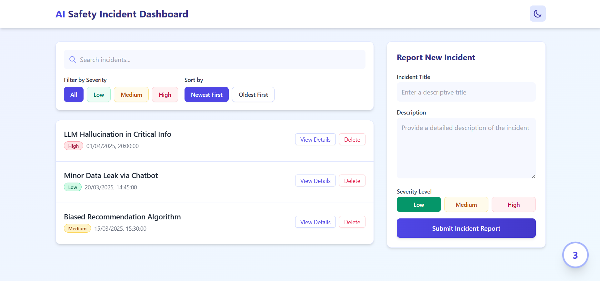

# AI Safety Incident Dashboard

A comprehensive dashboard for tracking, reporting, and managing AI safety incidents. This application provides a user-friendly interface to log incidents, filter them by severity, and manage the incident database.



## Features

### Frontend Highlights

- **Responsive Design**: Fully responsive UI that works on all device sizes
- **Dark/Light Mode**: Toggle between dark and light themes with persistent user preference
- **Real-time Filtering**: Filter incidents by severity (Low, Medium, High)
- **Advanced Search**: Search through incident titles and descriptions
- **Sorting Options**: Sort incidents by newest or oldest first
- **Interactive Components**:
  - Expandable incident details
  - Animated incident counter
  - Confirmation dialogs for destructive actions
  - Toast notifications for user feedback
- **Accessibility**: Focus states, semantic HTML, and keyboard navigation
- **Offline Capability**: Uses IndexedDB for local data persistence
- **Smooth Transitions**: CSS animations and transitions for a polished UX

### Technical Implementation

- **React**: Built with React for component-based architecture
- **TypeScript**: Type-safe code to prevent runtime errors
- **Local Storage**: Persists theme preferences across sessions
- **IndexedDB**: Stores incident data locally in the browser
- **Tailwind CSS**: Utility-first CSS framework for styling
- **Custom Animations**: Hand-crafted CSS animations for interactive elements

## Deployment

The application is containerized with Docker and deployed via GitHub Actions CI/CD pipeline to an EC2 instance.

### Port Configuration

The application serves content on port 443 (HTTPS) externally while using port 4000 internally:

- Nginx inside the container listens on port 80
- Internal port mapping: 80 → 4000
- External port mapping: 4000 → 443 (via SSL termination)

## Getting Started

### Prerequisites

- Node.js (v18+)
- npm or yarn

### Installation

1. Clone the repository:
   ```
   git clone https://github.com/ayushpratapsingh1/Sparklehood.git
   cd Sparklehood
   ```

2. Install dependencies:
   ```
   npm install
   ```

3. Start the development server:
   ```
   npm run dev
   ```

4. Build for production:
   ```
   npm run build
   ```

### Docker Deployment

1. Build the Docker image:
   ```
   docker build -t dashboard:latest .
   ```

2. Run the container:
   ```
   docker run -p 4000:80 dashboard:latest
   ```

## CI/CD Pipeline

The project uses GitHub Actions for continuous integration and deployment:

1. On push to master branch, the workflow is triggered
2. The React application is built and containerized
3. The Docker image is pushed to Docker Hub
4. The latest image is deployed to an EC2 instance

## Security Considerations

- HTTPS enabled for secure communication
- Environment variables for sensitive information
- Input validation for user-submitted data
- Docker for consistent and isolated environments

## Future Enhancements

- User authentication and multi-user support
- API integration for remote data storage
- Advanced analytics and reporting
- Automated incident classification with AI

## License

[MIT License](LICENSE)
